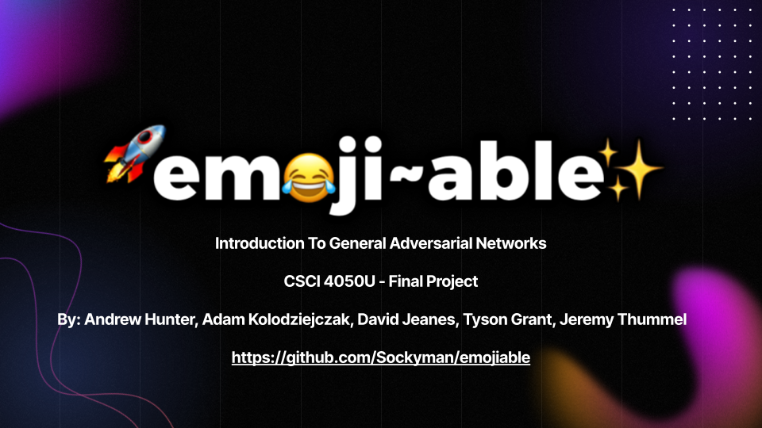
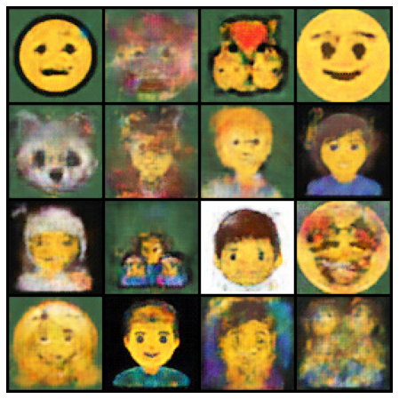

## An experimental study of the theory and implementation of Generative Adversarial Networks (BONUS WGAN)
### Purpose 
- Investigated the training, deployment, and integration of Generative Neural Networks by creating an Emoji Generator.
- Used a dataset containing emoticons from a wide range of companies (Apple, Samsung, Google, Gmail, Facebook, DoCo, KDDI, and more).
- The goal is to generate artificial emojis which look like they could be real emojis.

### Model
Please Refer to the slide and video for more details and References regarding the model!

Watch This Video Below:

### Examples
GAN: 

(BONUS: Wgan):

